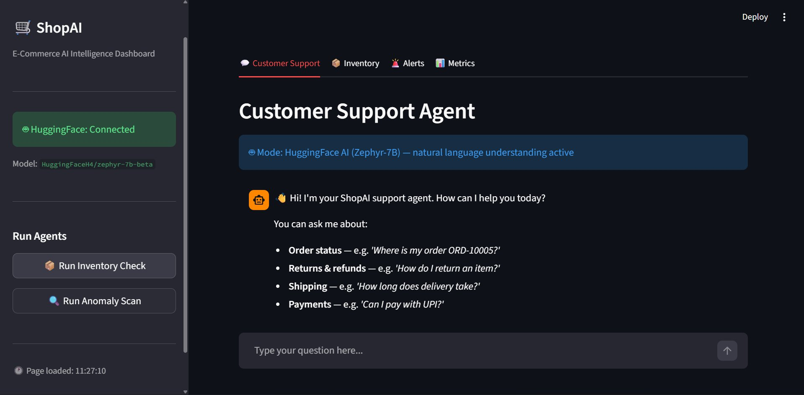
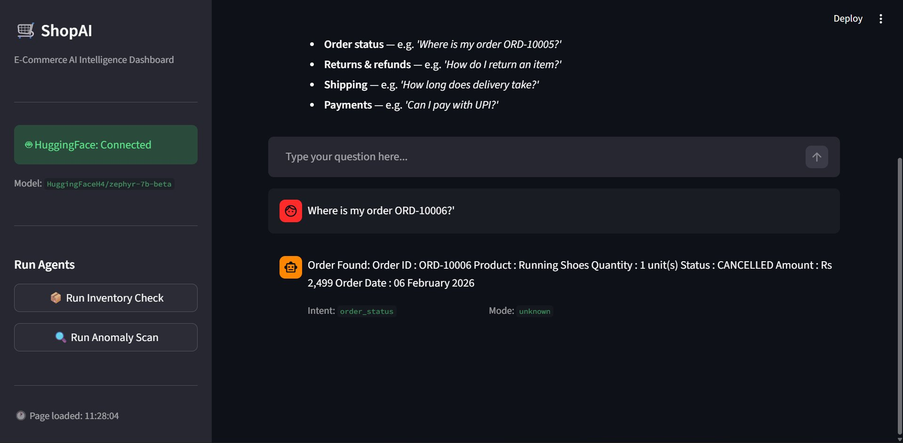
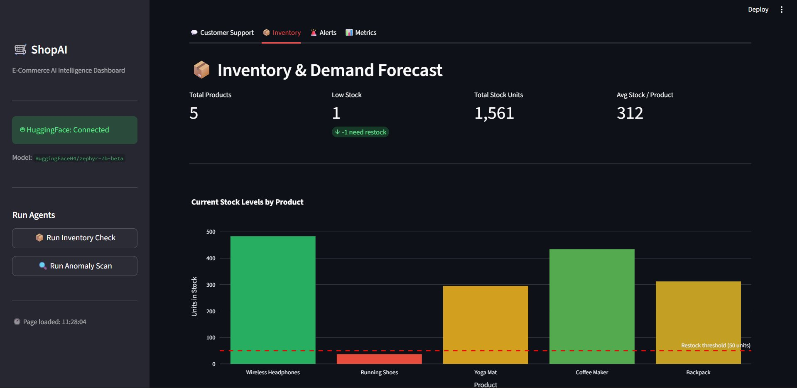
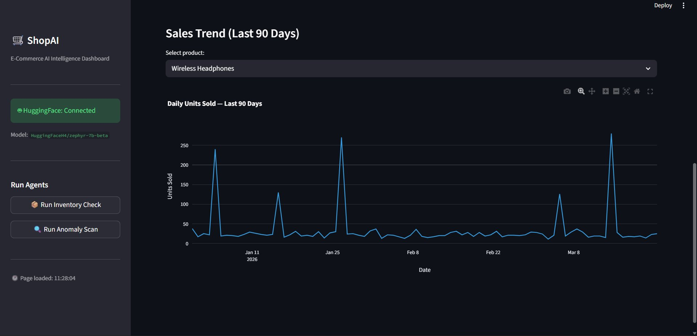
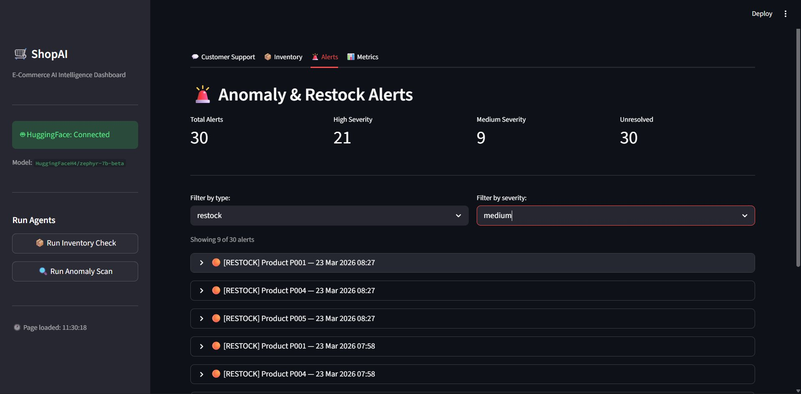
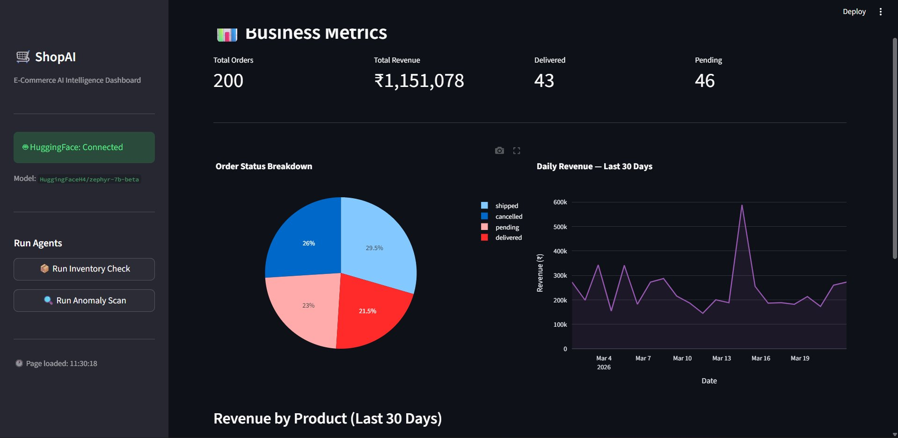
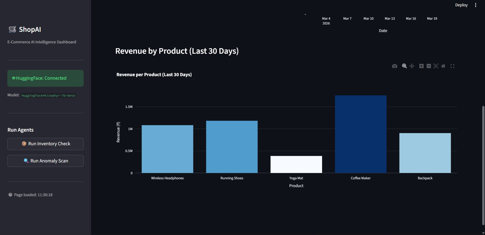

# 🛒 ShopAI — Autonomous E-Commerce AI Agent
### 100% FREE · No OpenAI Key Required

> A production-ready **multi-agent AI system** for e-commerce operations, powered entirely by free HuggingFace models. Handles customer support, inventory forecasting, anomaly detection, and business analytics — all in one Streamlit dashboard.


---

## 📸 Screenshots

### 💬 Customer Support Agent
AI-powered chat interface using Zephyr-7B — handles order lookups, returns, shipping, and payments.





---

### 📦 Inventory & Demand Forecast
Real-time stock levels per product with restock threshold indicators and Prophet demand forecasting.





---

### 🚨 Anomaly & Restock Alerts
Live alerts from Isolation Forest anomaly detection and Prophet inventory agent — filterable by type and severity.



---

### 📊 Business Metrics
KPI overview: total orders, revenue, order status breakdown (pie chart), and daily revenue trend.





---

## 🏗️ Architecture

```
Customer Query ──→ [LangGraph Orchestrator]
                          │
             ┌────────────┼────────────┐
             ↓            ↓            ↓
    [Customer Agent] [Inventory]  [Anomaly]
    HuggingFace LLM   Prophet     Isolation
    + Rule-based      Forecast    Forest
    fallback          (Prophet)   (sklearn)
             │            │            │
             └────────────┴────────────┘
                          │
              [SQLite DB + Streamlit UI]
                          │
                    [MLflow Tracking]
```

### Agents

| Agent | Model | Responsibility |
|---|---|---|
| **Customer Agent** | `HuggingFaceH4/zephyr-7b-beta` + rule-based fallback | Answers support queries (order status, returns, shipping, payments) |
| **Inventory Agent** | Facebook Prophet | Forecasts 30-day demand per product; fires stockout alerts |
| **Anomaly Agent** | scikit-learn Isolation Forest | Detects unusual sales spikes/drops; saves alerts to DB |

### Orchestration
A **LangGraph state machine** (`orchestrator/graph.py`) routes each event to the correct agent based on `event_type`. All nodes share a typed `AgentState` object containing the query, intent, response, and results from each agent.

---

## ✨ Features

- 💬 **AI Customer Support** — Natural language queries answered by Zephyr-7B with smart rule-based fallback (works offline, no token needed)
- 📦 **Demand Forecasting** — Facebook Prophet models trained per product, forecasts next 30 days of demand
- 🚨 **Anomaly Detection** — Isolation Forest detects sales spikes/drops; filterable alerts by type and severity
- 📊 **Business Metrics** — Live KPIs: total orders, revenue (₹), delivered/pending counts, order status pie, daily revenue line chart
- 📈 **Per-Product Sales Trends** — 90-day daily units sold chart with product selector
- 🧪 **MLflow Experiment Tracking** — All training runs logged with metrics and artifacts
- 🐳 **Docker Support** — Single `docker-compose up` for fully containerized deployment
- 🔄 **Auto-Refresh** — Dashboard data refreshes every 60 seconds via Streamlit cache

---

## 📁 Project Structure

```
ecommerce-ai-agent/
├── agents/
│   ├── customer_agent.py      # Zephyr-7B LLM + rule-based fallback
│   ├── inventory_agent.py     # Prophet-based demand forecasting
│   └── anomaly_agent.py       # Isolation Forest anomaly detection
├── orchestrator/
│   └── graph.py               # LangGraph state machine router
├── models/
│   ├── train_forecast.py      # Train Prophet models (~2 min)
│   └── train_anomaly.py       # Train Isolation Forest (~30 sec)
├── tools/
│   ├── order_lookup.py        # LangChain tool: DB order lookup
│   ├── faq_tool.py            # LangChain tool: FAQ matching
│   └── restock_tool.py        # LangChain tool: restock alerts
├── database/
│   ├── db.py                  # SQLAlchemy engine + session
│   └── models.py              # ORM models (Order, Product, Alert, etc.)
├── dashboard/
│   └── app.py                 # Streamlit UI — 4 tabs
├── scripts/
│   └── generate_sample_data.py
├── screenshots/               # UI screenshots
├── .env.example
├── requirements.txt
├── Dockerfile
└── docker-compose.yml
```

---

## 🚀 Quick Start (5 Steps)

### Step 1 — Get a Free HuggingFace Token *(optional but recommended)*

1. Go to [huggingface.co](https://huggingface.co) → create a free account
2. Settings → Access Tokens → **New Token** → select **Read** permission
3. Copy your token (starts with `hf_`)

> **No token?** The project works without it — the customer agent automatically switches to rule-based mode.

### Step 2 — Install & Configure

```bash
# Clone the repository
git clone https://github.com/prashant000000004/e-commerce-ai-agent.git
cd e-commerce-ai-agent/ecommerce-ai-agent

# Create a virtual environment
python -m venv venv
source venv/bin/activate        # Windows: venv\Scripts\activate

# Install dependencies
pip install -r requirements.txt

# If Prophet fails to install:
# pip install prophet --no-build-isolation

# Set up environment variables
cp .env.example .env
# Open .env and set:  HF_TOKEN=hf_xxxxxxxxxxxxxxxx
```

### Step 3 — Generate Sample Data

```bash
python scripts/generate_sample_data.py
```

Creates: **5 products**, **200 orders**, **1 year** of daily sales (1,825 records) in SQLite.

### Step 4 — Train the ML Models

```bash
python models/train_forecast.py    # ~2 minutes — trains 5 Prophet models
python models/train_anomaly.py     # ~30 seconds — trains Isolation Forest
```

Track all runs at: `mlflow ui` → http://localhost:5000

### Step 5 — Launch the Dashboard

```bash
streamlit run dashboard/app.py
```

Open: **http://localhost:8501**

---

## 🐳 Docker Deployment

```bash
cp .env.example .env
# Edit .env with your HF_TOKEN

docker-compose up --build
```

Dashboard available at **http://localhost:8501**

---

## 🧪 Test Individual Agents

```bash
python agents/customer_agent.py    # Test customer support
python agents/inventory_agent.py   # Test inventory forecast
python agents/anomaly_agent.py     # Test anomaly detection
python orchestrator/graph.py       # Test full LangGraph orchestration
```

---

## 🔑 Environment Variables

| Variable | Description | Default |
|---|---|---|
| `HF_TOKEN` | HuggingFace API token (free) | — (uses rule-based fallback) |
| `HF_MODEL` | Model to use | `HuggingFaceH4/zephyr-7b-beta` |
| `DATABASE_URL` | SQLite path | `sqlite:///./ecommerce.db` |
| `MLFLOW_TRACKING_URI` | MLflow experiment folder | `./mlruns` |
| `MODEL_DIR` | Saved model directory | `./models/saved` |

### Supported HuggingFace Models

| Model ID | Description |
|---|---|
| `HuggingFaceH4/zephyr-7b-beta` | Recommended — best quality |
| `google/flan-t5-large` | Faster, lighter |
| `mistralai/Mistral-7B-Instruct-v0.1` | Alternative 7B |
| `tiiuae/falcon-7b-instruct` | Falcon-7B |

---

## 💡 How the AI Works Without an API Key

The customer agent operates in two modes:

**LLM Mode** (with `HF_TOKEN`): Uses Zephyr-7B via HuggingFace's free inference servers for full natural language understanding — intent detection, context-aware responses, and open-ended question handling.

**Rule-based Mode** (no token): Uses keyword intent matching + direct SQLite order lookups + pre-written FAQ answers. Same tools, same database — only response quality for open-ended questions differs.

---

## 🛠️ Troubleshooting

| Problem | Fix |
|---|---|
| `langchain_community` import error | `pip install langchain-community --upgrade` |
| `langchain_huggingface` not found | `pip install langchain-huggingface` |
| Prophet install fails | `pip install prophet --no-build-isolation` |
| LangGraph version conflict | `pip install langgraph==0.1.0 --force-reinstall` |
| HuggingFace API slow | Their servers are busy — wait 30s and retry |
| No data in dashboard | Run `python scripts/generate_sample_data.py` |
| Models not found | Run `train_forecast.py` and `train_anomaly.py` first |

---

## 🧰 Tech Stack

| Layer | Technology |
|---|---|
| LLM | HuggingFace Zephyr-7B (free inference API) |
| Agent Orchestration | LangGraph 0.2.0 |
| LLM Framework | LangChain 0.2.0 + langchain-community |
| Demand Forecasting | Facebook Prophet |
| Anomaly Detection | scikit-learn Isolation Forest |
| Dashboard | Streamlit + Plotly |
| Database | SQLite + SQLAlchemy |
| Experiment Tracking | MLflow 2.10.0 |
| Containerisation | Docker + Docker Compose |
| Logging | Loguru |

---

## 📄 License

MIT License

---

## 👤 Author

**Prashant**
GitHub: [@prashant000000004](https://github.com/prashant000000004)
